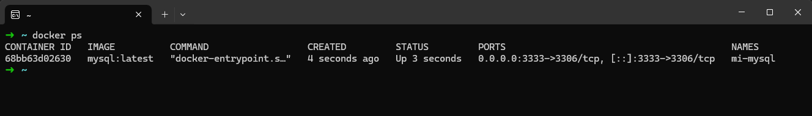

# Nombre Aplicacion
MYSQL

# Comandos ejecutados
docker run --name mi-mysql -e MYSQL_ROOT_PASSWORD=my-password -p 3333:3306 -d mysql:latest  

## Verificar que se creo el contenedor
docker ps

## Consulta los logs del container
docker logs mi-mysql   

# Accede al servicio (navegador para httpd, logs para redis/mysql) 
docker logs some-mysql

